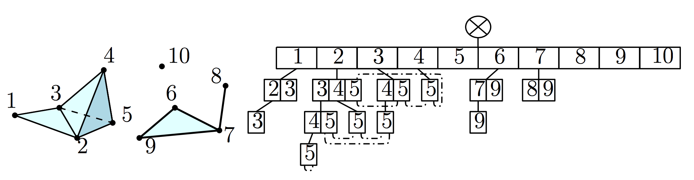

# simplextree

[![](https://img.shields.io/badge/docs-quarto-blue.svg?logo=data:image/png;base64,iVBORw0KGgoAAAANSUhEUgAAAEMAAABDCAMAAADwFEhBAAAABGdBTUEAALGPC/xhBQAAACBjSFJNAAB6JgAAgIQAAPoAAACA6AAAdTAAAOpgAAA6mAAAF3CculE8AAAB2lBMVEUAAABxvP90vP9zu/90u/90u/90u/90u/91uv91vP9zuv91v/91uv91u/9zvP90u/90uv92uv+As/91u/91u/90u/90u/90vP+Aqv90u/91u/9zuv90uf90u/90u/90u/9zuf9ttv90u/90u/91vP8A//92uv90u/95tv9zuv90u/90vP9zuv90u/91uv91u/90u/90vP90uf9zvP90u/93vv90u/90u/93u/9qv/90u/9zu/91vP90u/90vP95vP9Vqv90u/90u/91u/90u/90uf+Av/91u/90u/9xvf90u/91vP92vv90u/+AgP90u/9zu/91vP9vvP90u/90uv90u/94tP90u/9zvP90uv90u/90u/91u/90vP9zu/90uv91u/90uv9zvP9zuv9xu/9zvP90u/90u/90vP9zvP90uf9xxv90u/90uv90u/9zvf90u/90u/90u/90uv91uv90vP90uf90u/91vP90u/9wuP9zu/9zvP9zuv90u/92v/90uv90vP9yvP90uv90u/9mzP91u/90vP90u/92vP90vP9zvP90u/90u/90u/90u/9yuv91uv90u/91vP91u/90u/90u/9zu/91vf90u/90u/91u/90u//////Zz6urAAAAnHRSTlMAImOdxOv+4LqQWRgwjt/NdxoKadL8uUQGcOjJTUvbvygOpfh2ATTaFV3kLnPvP4P3ckJb8Cv12Q8M16ibWjkTA8+VYvshBJdWG8OBJ+ICfzyMF9FR/RGERauW9LHBvqfHhp9vLTWwqWdUFgm1kU8f+taeXCWIC+FI7BmHUInVHOO9JraiBa9950HMaulA5chOVbQ9pObcUiN1k23io9BOAAAAAWJLR0SdBrvysQAAAAd0SU1FB+cIFgIIE8103aAAAAEhelRYdFJhdyBwcm9maWxlIHR5cGUgeG1wAAAokXVSS3LFIAzbc4oegcjGJsdJH7DrTJc9fmWSvqR5LZ78bCNLIunr4zO9xRJIkodX2bxa82zNiqstyPFtD+suUZMG2GJqw2BFtj3/7B4AcjphmHyPLaVqKxlZxYZzI7IUdFFeGZCeN+QIUgDBTbYC1aR2m78Xg0N1ZWTZOHP4XOjOJvQ5wjFkkTUCI0kWMAHe2w7Cp/hKWNL2ihYDonxyuTNStZJcTJhYp7SVLnQyPBroCzibTgRDGvEL6Bpe00VUANlfsianftrNd/pnjYKPPSFtmSaOV+pPAT8DNg1nViuH7EOBdDr1SCfq/413bzCu7uzmpKs716M9m+Nw1aI2sy9/XVTSN0+AmxnAMJeGAAAAAW9yTlQBz6J3mgAAAipJREFUWMPt11lb00AYBeDPhXGDVpEiorhQKkWsglYFrRJFq6KiAkpVXFHR1qXuirvivqK4nx9r0tRCIEln5rvlXOXi5L3Ikzl5QuSVKVOnTS8BrEuIGTNnzZ5DaiktC8BOzshFBOfOkwbK51egkFHDTKhygZRQtbAa8DDMLFpcnKhZAvgZwNJl/sLyWqCYgXBdxIdYUQ8JA6iMehINYcgZWNnoQawSkDUQW+1KrAHkDTTVuBDNUDLQtHYCsU4oGoivH0c0boCqgY0tDqJ1E9QNbHYYCegY2DKG2Cr0jJK2AmFsg56B7QWjHbrGjp15IhnQNrArb+yGvhHeYxsdDAN7c8Q+cIz9nVbjAMvAQasR5BmHzEKX4BndZqEHPOPwEaJepoEU0VGu0UxUwTWOER3nGn1kgGucoMk4YwjuMz1JVM01ThGd5hpniM5yjQaifq5xjug804ibY2jEeMYFqzHAMy5ajUssI5S2GpkYx7hsv6pXOMZV27iW1Teud+bPzA194+b/c3crq2vUJwuH97aukRodgDt39YyBsStyT+gY9wcdU/RAwxAPnXOW7FA3Ho3fxOhjVaPPmDCsT56qGc8yLuv8PKBivCh3nfjBbnlj6KXHd6LllaQReu39VxjpD8sYb96SX0rfFTdqo+Sf5PsP/kbwIxVPa90nb+Pzl4gEYaZq+GvWzYgnvskBdtLtI9+dxo/Ez4yKYOdXz+8/Q9bFSNnfVFr9fpX8A/gO4x9ExakgAAAAUGVYSWZNTQAqAAAACAACARIAAwAAAAEAAQAAh2kABAAAAAEAAAAmAAAAAAADoAEAAwAAAAEAAQAAoAIABAAAAAEAAABDoAMABAAAAAEAAABDAAAAAEC2TfoAAAAldEVYdGRhdGU6Y3JlYXRlADIwMjMtMDgtMjJUMDI6MDg6MTgrMDA6MDDjF9jVAAAAJXRFWHRkYXRlOm1vZGlmeQAyMDIzLTA4LTIyVDAyOjA4OjE4KzAwOjAwkkpgaQAAACh0RVh0ZGF0ZTp0aW1lc3RhbXAAMjAyMy0wOC0yMlQwMjowODoxOSswMDowMGMoSgIAAAARdEVYdGV4aWY6Q29sb3JTcGFjZQAxD5sCSQAAABJ0RVh0ZXhpZjpFeGlmT2Zmc2V0ADM4rbi+IwAAABd0RVh0ZXhpZjpQaXhlbFhEaW1lbnNpb24ANjeFsWfdAAAAF3RFWHRleGlmOlBpeGVsWURpbWVuc2lvbgA2N1gnvlgAAAASdEVYdHRpZmY6T3JpZW50YXRpb24AMber/DsAAAAASUVORK5CYII=)](https://peekxc.github.io/simplextree-py/pages/)
[](https://coveralls.io/github/peekxc/simplextree-py) 
[](https://github.com/peekxc/simplextree-py/actions/workflows/build_macos.yml) 
[](https://github.com/peekxc/simplextree-py/actions/workflows/build_windows.yml) 
[](https://github.com/peekxc/simplextree-py/actions/workflows/build_linux.yml)
[](https://pypi.org/project/simplextree)
[](https://github.com/peekxc/simplextree-py/actions)

`simplextree` is an Python package that simplifies computation for general [simplicial complexes](https://en.wikipedia.org/wiki/Simplicial_complex) of any dimension by providing [pybind11](https://github.com/pybind/pybind11) bindings to a *Simplex Tree* data structure implemented in modern C++17.

A *Simplex Tree* is an ordered, [trie](https://en.wikipedia.org/wiki/Trie)-like structure whose nodes are in bijection with the faces of the complex. Here's a picture of a simplicial 3-complex (left) and its corresponding Simplex Tree (right):



The *Simplex Tree* was originally introduced in the following paper:

> Boissonnat, Jean-Daniel, and Clément Maria. "The simplex tree: An efficient data structure for general simplicial complexes." Algorithmica 70.3 (2014): 406-427.

The `SimplexTree` class exported by the package includes support for many tree operations, e.g. insertions, removals, expansions, collapses, star/link enumerations, and other traversals.

## Install

The easiest way to install the package is via the platform-specific [wheels](https://pythonwheels.com/) on [pypi](https://pypi.org/project/simplextree/).

``` bash
python -m pip install simplextree 
```

You can also `pip install` the package manually by downloading the appropriate wheel (or sdist) from the [releases](https://github.com/peekxc/simplextree-py/releases/).

For installation instructions for developers looking to extend the package, see [Building & Developing](#building--developing).

## Quickstart

``` python
## The SimplexTree class provides light wrapper around the extension module
from simplextree import SimplexTree 
st = SimplexTree([[0,1,2], [0,1], [4,5]]) 
print(st) 
# Simplex Tree with (5, 4, 1) (0, 1, 2)-simplices

## Batch insertion, removal, and membership queries are supported
st.insert([[1,4], [1,5], [6]])
# Simplex Tree with (6, 6, 1) (0, 1, 2)-simplices 

st.remove([[6]])
# Simplex Tree with (5, 6, 1) (0, 1, 2)-simplices

st.find([[6], [0,1]])
# array([False,  True])

## Collections of simplices are returned as simple lists-of-lists
print(st.simplices())
# [[0],[1],[2],[4],[5], [0,1],[0,2],[1,2],[1,4],[1,5],[4,5],[0,1,2]])

print(st.skeleton(1)) 
# [[0],[1],[2],[4],[5], [0,1],[0,2],[1,2],[1,4],[1,5],[4,5]])

## Familiar Pythonic collection semantics are supported, including contains and iteration
[0,1,2] in st
# True 

[len(simplex) for simplex in st]
# [1, 1, 1, 1, 1, 2, 2, 2, 2, 2, 2, 3]

## Various subsets of the complex can be enumerated
st.cofaces([1])
# [[1], [0,1], [1,2], [1,4], [1,5], [0,1,2], [1,4,5]]

st.maximal()
# [[0, 1, 2], [1, 4], [1, 5], [4, 5]]

## Basic properties are also available as attributes 
st.connected_components 
# [1,1,1,1,1]

st.vertices
# [0,1,2,4,5]

st.n_simplices, st.dimension
# [5, 6, 1], 2

## Interoperability with numpy is provided whenever possible
all(np.all(st.triangles == np.array(st.simplices(p=2)), axis=0))
# True 

## Other complex-wide operations are supported, like k-expansions 
st.insert([[1,4]]) 
st.expand(2)       
# Simplex Tree with (6, 6, 2) (0, 1, 2)-simplices

## The trie-structure can also be inspected on the python side 
st.print_tree()
# 0 (h = 2): .( 1 2 )..( 2 )
# 1 (h = 1): .( 2 4 5 )
# 2 (h = 0): 
# 4 (h = 1): .( 5 )
# 5 (h = 0): 

st.print_cousins()
# (last=1, depth=2): { 0 1 } 
# (last=2, depth=2): { 0 2 } { 1 2 } 
# (last=4, depth=2): { 1 4 } 
# (last=5, depth=2): { 4 5 } { 1 5 } 
# (last=2, depth=3): { 0 1 2 } 
```

## Building & Developing

If you would like to build the package yourself for development reasons, a typical workflow is to install the [build-time dependencies](https://pip.pypa.io/en/stable/reference/build-system/pyproject-toml/#build-time-dependencies) first:

``` bash
python -m pip install meson-python ninja pybind11 numpy
```

Then, build and install the package in [editable mode](https://peps.python.org/pep-0660/) (see also [meson-python notes](https://meson-python.readthedocs.io/en/latest/how-to-guides/editable-installs.html)), optionally without build isolation for speed:

``` bash
python -m pip install --no-build-isolation --editable .
```

Unit testing is handled with [pytest](https://docs.pytest.org/en/7.4.x/). See the [gh-workflows](https://github.com/peekxc/simplextree-py/actions) for platform-specific configuration.

## Native Extensions

The underlying C++ library is [header-only](https://en.wikipedia.org/wiki/Header-only) and may be included as a dependency by [extension modules](https://docs.python.org/3/extending/extending.html) in other Python packages.

Thus, to modify or extending the complex in C++, it is sufficient to add the package as a build-time dependency and append the include directory to the compilation target.